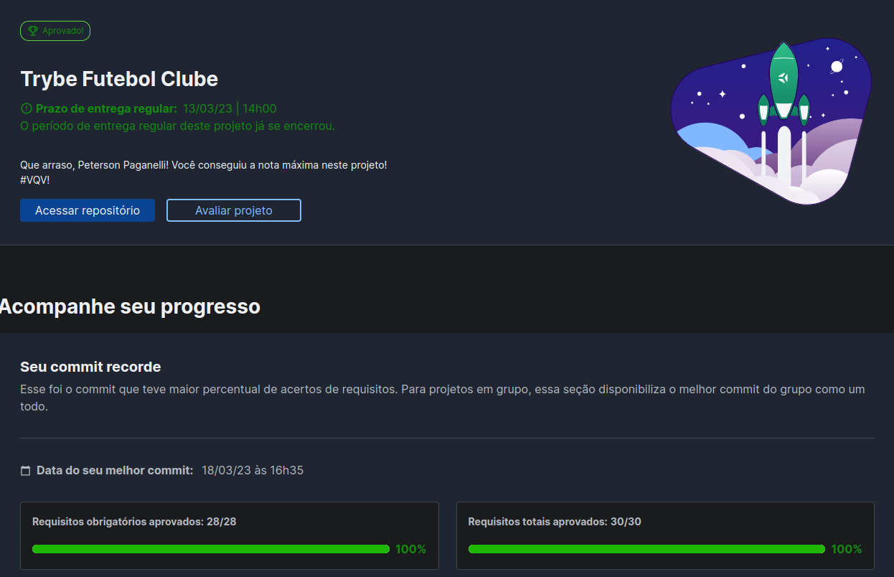

# Trybe Futebol Club
<h1>Descrição</h1>

  
Projeto desenvolvido na Trybe durante o módulo de Back-End

  
esse projeto é um site informativo sobre partidas e classificações de futebol!

  
Para adicionar uma partida é necessário ter um token, portanto a pessoa deverá estar logada para fazer as alterações. Temos um relacionamento entre as tabelas teams e matches para fazer as atualizações das partidas.

  

  
Detalhes

    <ul>
    <li>Endpoints desenvolvidos e conectados com o banco de dados seguindo os princípios REST</li>
    <li>Para a criação, atualização e finalização de uma partida é necessário um admin estar logado</li>
    <li>login: admin@admin.com senha: senha_admin</li>
  </ul>
   
  

<h1>Ferramentas</h1>

  <ul>
    <li>Javascript</li>
    <li>Typescript</li>
    <li>Docker</li>
    <li>Node.js</li>
    <li>Sequelize</li>
    <li>mySQL</li>
  </ul>

<h1>Resultado</h1>

<h1>Contato</h1>

  
  
  
Email: petersonpaganelli@outlook.com

